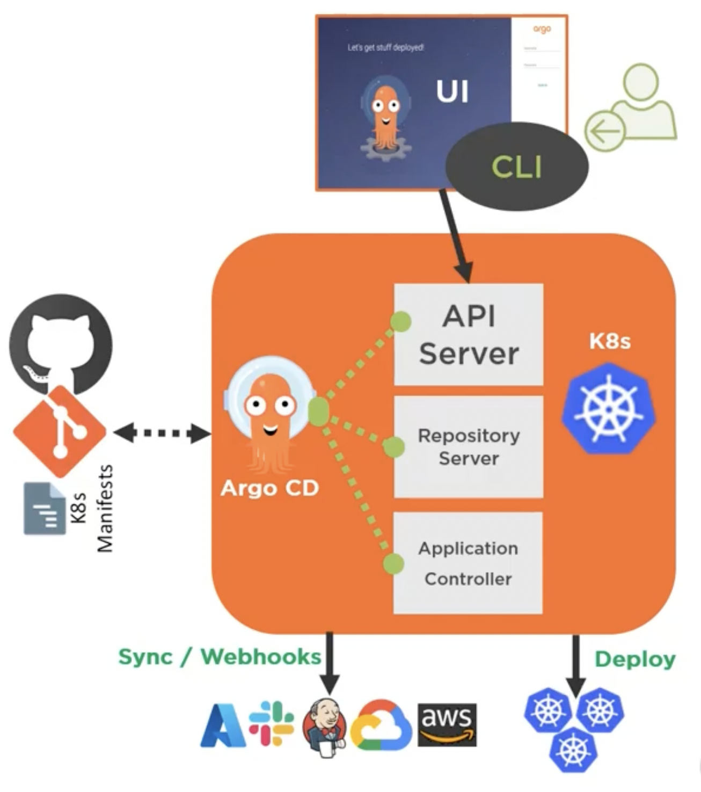
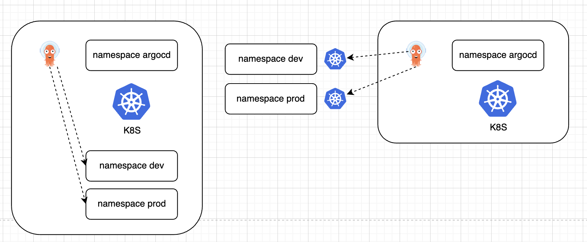

# Argo CD Architecture


## Requirements for Argo CD
1. kubectl command-line tool
2. Kubernetes cluster to host Argo CD
3. Cluster admin level access
4. kubeconfig configured to connect Kubenetes cluster
5. Access to Github or other repo

## Types of Argo CD install
| Non HA | HA      | Core install |
| :----  | :----   | :----        |
|<ul><li>install.yaml</li><li>recommended for dev</li><li>single pods</li><li>replicas for Argo CD</li></ul>|<ul> <li>namespace-install.yaml</li> <li>recommended for prod</li> <li>tuned for HA and resiliency</li> <li>multiple replicas for suppoted components</li> </ul>|<ul> <li>core-install.yaml</li> <li>lightweigh</li> <li>no webui, API server not needed</li> </ul>|


## Cluster level & Namespace level

| Cluster level | Namespace level
| :----  | :---- |
| Use when you have cluster level access & will deploy apps in the same cluster that Argo CD runs on.|Use when you have namespace level access & will deploy apps external cluster from where Argo CD running|


## Deploying Argo CD
```bash
> k create namespace argocd
> k apply -n argocd -f https://raw.githubusercontent.com/argoproj/argo-cd/stable/manifests/install.yaml
> k port-forward service/argocd-server 8080:80 -n argocd
```

## Access ArgoCD By default
Use user name as ==admin== and get pwd from following command below
```
k get pods -n argocd -l app.kubernetes.io/name=argocd-server -o name | cut -d'/' -f 2
```

## Patch new password
k -n argocd patch secret argocd-secret \
  -p '{"stringData": {
    "admin.password": "$2a$10$BS4eb9kW9Nztvkw2ClfC/uf1nItujmpu8HamjR742tZ0QupbvuW7y",
    "admin.passwordMtime": "'$(date +%FT%T%Z)'"
  }}'

## Reset pwd
- https://argo-cd.readthedocs.io/en/release-1.8/faq/


Non-HA & HA Update
```
> k apply -n argocd -f https://raw.githubusercontent.com/argoproj/argo-cd/
<version>/manifests/install.yaml
> k apply -n argocd -f https://raw.githubusercontent.com/argoproj/argo-cd/<version>/manifests/ha/install.yaml
```

Accessing Argo CD API Server
1. WebUI
2. Argo CD CLI
```
> choco install argocd-cli
> brew install argocd
```

Common CLI
```
> argocd login
> argocd account
> argocd proj
> argocd app
> argocd repo
> argocd version
> argocd-util
> argocd cluster
```

Setting up RBAC for Argo CD
```
```

## Ingress
```
> k apply -f https://raw.githubusercontent.com/kubernetes/ingress-nginx/controller-v1.1.1/deploy/static/provider/cloud/deploy.yaml
```
Refs:
- https://kubernetes.github.io/ingress-nginx/deploy/#quick-start
- https://cloud.google.com/kubernetes-engine/docs/tutorials/http-balancer
- https://cloud.google.com/kubernetes-engine/docs/how-to/ingress-multi-ssl#secrets


## Helm CLI
```
> helm install demo-guestbook guestbook
> helm uninstall demo-guestbook
> helm list --short
> helm upgrade demo-guestbook guestbook
> helm status demo-guestbook
> helm rollback demo-guestbook 1
> helm history demo-guestbook
> helm install --dry-run --debug qa guestbook-umbrella
```